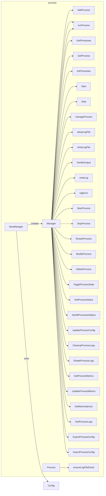
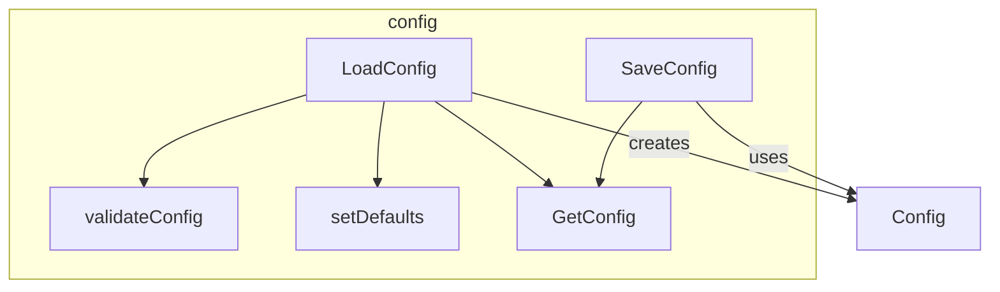
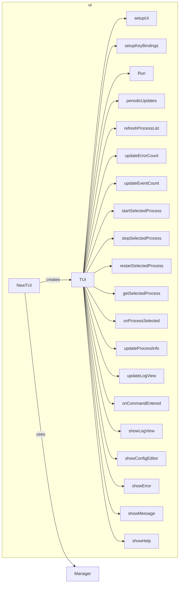

# gotaskmaster

GoTaskMaster is a flexible process management tool developed using the Go language and designed to simplify task management in complex environments. It provides a careful Terminal User Interface (TUI) that allows users to easily monitor, control and manage multitasking a process

## Main features

- Multi-environment support: Compatible with various bash environments, including scientific computing environments such as Anaconda.
- Interactive TUI: Provides colorful, multi-level menu interface and intuitive operation.
- Real-time process management: start, stop, restart processes, and monitor running status in real time.
- Custom task configuration: Flexibly set the commands, parameters, environment variables and number of instances of the process.
- Log management: Automatically collect and classify the standard output and error logs of each process.
- Resource Control: Limit the maximum number of instances of each task to avoid resource overuse.
- Statistics: Provides a statistical overview of running and stopped tasks.

## Applicable scenarios

GoTaskMaster is particularly suitable for the following scenarios:

- Manage complex development environments such as data science workflows
- Monitor and maintain long-running background services
- Automated testing and continuous integration/continuous deployment (CI/CD) processes
- Manage multiple components in a distributed system

## Technical features

- Developed using Go language, with excellent performance and cross-platform compatibility
- Build a beautiful TUI based on the Bubble Tea framework
- Using coroutines to achieve efficient concurrent task management
- Modular design, easy to expand and customize
